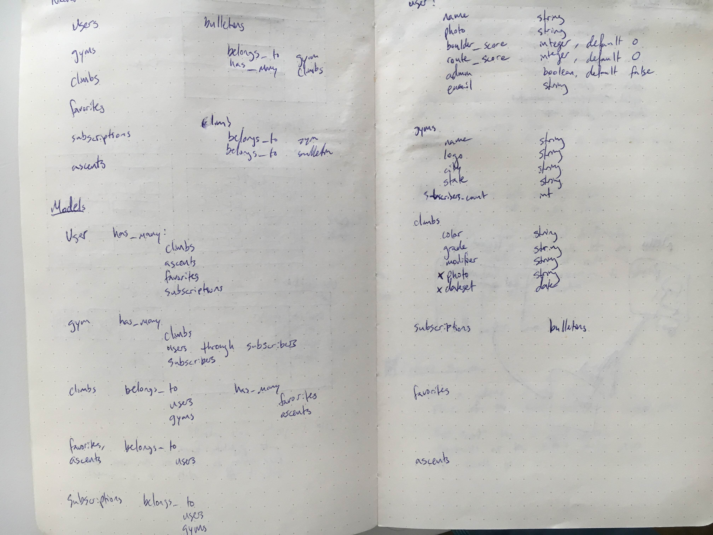

# Gym News API

## Hosted on Heroku

View app/API here: 
  [Gym News: Client](http://apalmer0.github.io/gym-news-front-end/index.html)
   
  [Gym News: API](https://gym-news.herokuapp.com/)

## Relationship Planning

Relationships:
  

## About

This is the back end that powers the Gym News Front End web app. There are a
    number of models and controllers in use here, specifically:

-   bulletins
-   climbs
-   favorites
-   gyms
-   users

A number of models are slated to be added to these, including:

-   ascents
-   subscriptions

All of this is to create an intuitive user experience for creating and
    accessing updates from a gym.

## Structure

This template follows the standard project structure in Rails 4.

`curl` command scripts are stored in [`scripts`](scripts) with names that
correspond to API actions.

## Code

-   This app is written with ruby on rails and PostgreSQL
